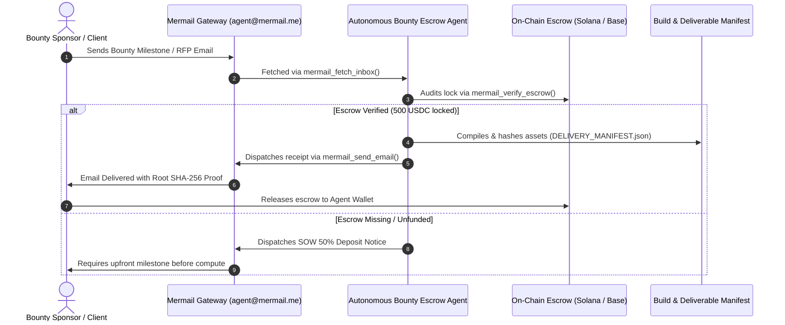

# Mermail Bounty Escrow Workflows

## Standard 4-Stage Autonomous Settlement Flow



## CLI Usage

### Stage 1: Inbound Discovery
```bash
python mermail_bounty_escrow.py --action scan --live
```

### Stage 2: Escrow Verification
```bash
python mermail_bounty_escrow.py --action verify --deal-id MSG-9042 --amount 500.0
```

### Stage 3: Seal Deliverables
```bash
python mermail_bounty_escrow.py --action deliver --target-dir . --deal-id MSG-9042
```

### Stage 4: Dispatch Proof of Work
```bash
python mermail_bounty_escrow.py --action dispatch --deal-id MSG-9042 --recipient bounties@superteam.fun --live
```
